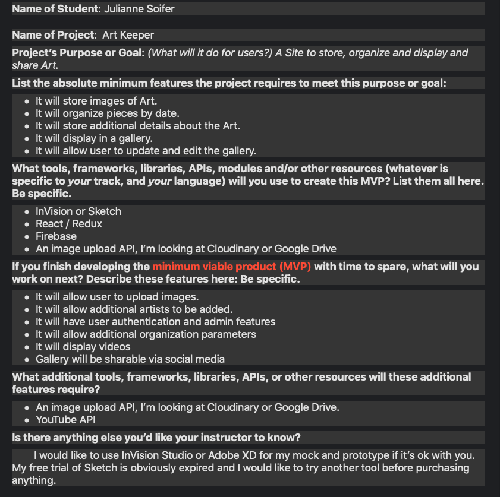
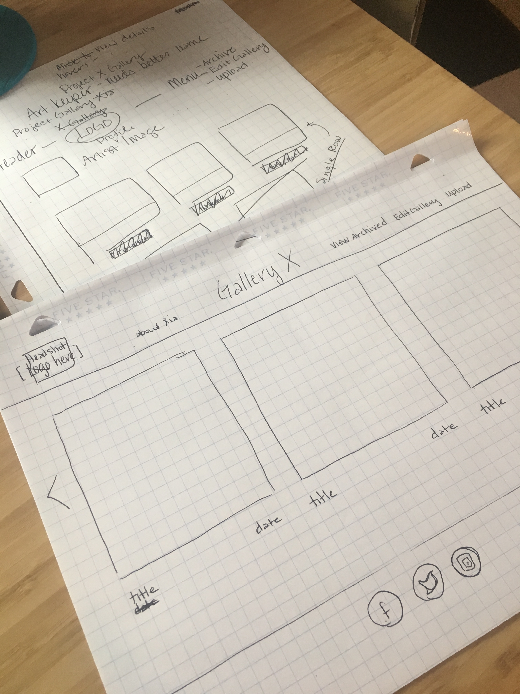
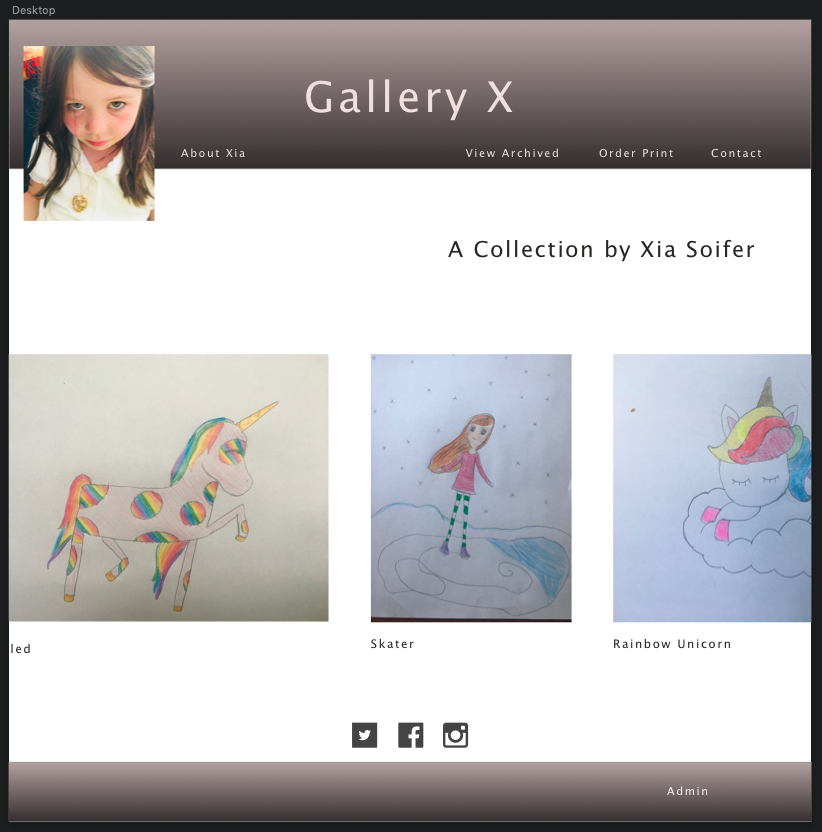
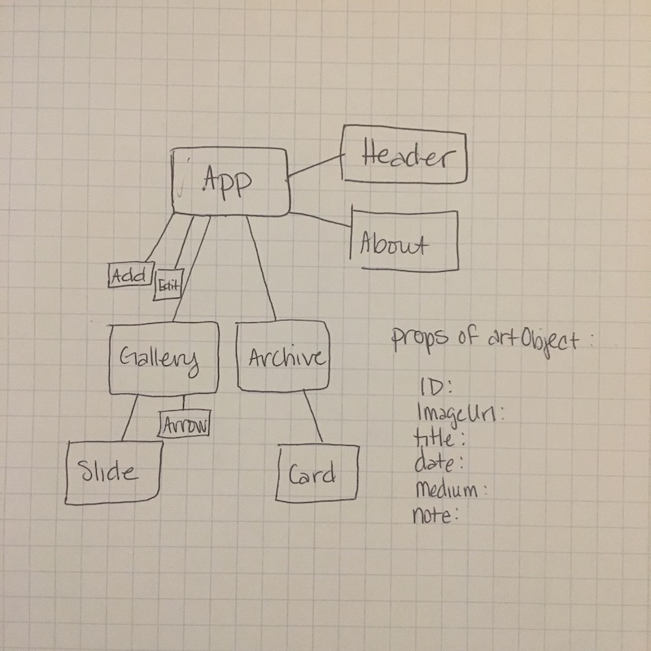

# Art Keeper - planning repo

This repository exists to organize and document the planning of my new React project, Art Keeper.

## Proposal

## User stories, mindmap, and initial sketches

### Mock

### Component Tree sketch and heirarchy arrangement

## Static site

[Link to Static Site](https://github.com/JSoifer/gallery-x.git)

### State Audit

Component heirarchy with stateful components and state tree defined.

## Built With

## Authors

* **Julianne Soifer**

## License

This project is licensed under the MIT License - see the [LICENSE.md](LICENSE.md) file for details

## Acknowledgments

* Hat tip to anyone whose code was used
* Inspiration
* etc
